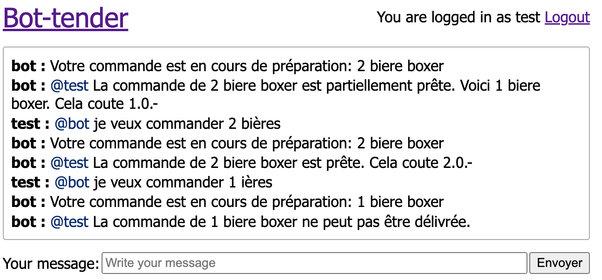
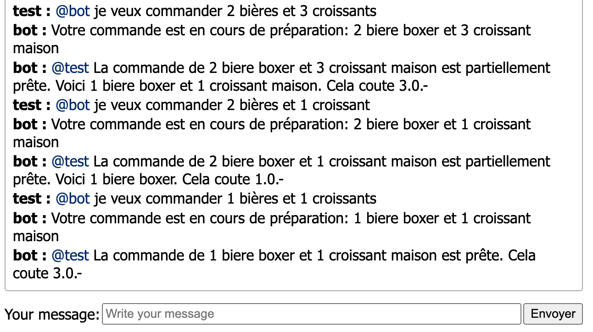

# SCALA - Labo 4 - Bot-Tender : Future

> Nicolas Crausaz & Maxime Scharwath

# Informations

Dans les itérations précèdentes de Bot-tender, on supposait une commande prête immédiatement. L’objectif
de ce labo est d’intégrer une gestion de commandes asynchrones en utilisant la classe Future de
l’API Scala.

# Choix architecturaux et d’implémentation

## Préparation des produits

Pour chaque marque de produit, nous avons spécifié un temps de préparation. Nous l'avons fait en modifiant la structure de données qui stocke les produits sous la forme d'un `Map[String, (Double, Duration)]`. Pour appliquer les temps de préparation, nous avons ajouté une méthode `startPreparation` au `ProductService` chargée de préparer une produit de manière asynchrone (future), avec une probabilité 0.5 de réussite.

## AnalyzerService

Le bot recevant une commande est capable de récéptionner une commande et de la préparer dans une Future. Afin de répondre directement au client, le bot renvoie un tuple contenant la réponse immédiate et la réponse future.

Comme indiqué au point précédent, une commande peut échouer, ainsi lors de commande de plusieurs produits (n fois le même ou plusieurs produits différents), il est possible que certains produits ne soient pas disponibles. Pour gérer ce cas, nous avons ajouté un enum `PreparationStatus` qui permet de gérer les différents résultats de la préparation des commandes (Success, Partial, Failure).

Grâce à cela, nous pouvons gérer les échecs et les commandes partiellement préparées, notamment pour les commandes avec plusieurs produits et répondre au client en conséquence.

Voici quelques exemples de réponses possibles avec la commande d'un produit (quantité n):



Chaque produit est préparé de manière séquentielle (un après l'autre)

La commande de plusieurs produits en quantités différentes (ET) à été implementée grâce à l'utilisation de `foldLeft`:

```scala
val preparations = (1 to quantity).foldLeft(
  Future.successful(List.empty[PreparationStatus])
) { (previousFuture, _) =>
  previousFuture.flatMap { list =>
    productSvc
      .startPreparation(name, brand)
      .map(_ => PreparationStatus.Success)
      .recover(_ => PreparationStatus.Failure)
      .map(result => list :+ result)
  }
}
```

Le nombre de succès est ensuite compté et comparé au nombre de produits commandés pour déterminer le résultat de la commande (Success, Partial, Failure).

Pour la préparation de plusieurs produits en plusieurs quantités (ET), chaque type de produit est préparé en parallèle, puis les n produits sont préparés séquentiellement. Le résultat est ensuite calculé de la même manière que pour la commande d'un produit:

```scala
val leftPreparation = prepare(left)
val rightPreparation = prepare(right)

for {
  (leftResult, leftStatus) <- leftPreparation
  (rightResult, rightStatus) <- rightPreparation
} yield {
  (leftStatus, rightStatus) match {
    // Both success
    case (PreparationStatus.Success, PreparationStatus.Success) =>
      (Some(And(left, right)), PreparationStatus.Success)

    // Both failed
    case (PreparationStatus.Failure, PreparationStatus.Failure) =>
      (None, PreparationStatus.Failure)

    // Both partial
    case (PreparationStatus.Partial, PreparationStatus.Partial) =>
      (
        Some(And(leftResult.get, rightResult.get)),
        PreparationStatus.Partial
      )

    // One failed, return the one that didn't
    case _ =>
      (leftResult.orElse(rightResult), PreparationStatus.Partial)
  }
```

Voici un exemple de réponse possible avec la commande de plusieurs produits:



Une fois la commande préparée, le bot envoie un message au client pour l'informer que sa commande est prête (ou échec).
Nous pouvons gérer facilement les trois status possibles grâce à notre enum:

```scala
val baseOrder = inner(products)._1
val order = prepare(products)
  .map(task => {
    task._2 match
      case PreparationStatus.Success => {
        accountSvc.purchase(user, orderPrice)
        s"La commande de ${baseOrder} est prête. Cela coute $orderPrice.-"
      }

      case PreparationStatus.Partial => {
        val ajustedPrice = computePrice(task._1.get)
        val adjustedOrder = inner(task._1.get)._1
        accountSvc.purchase(user, ajustedPrice)
        s"La commande de ${baseOrder} est partiellement prête. Voici ${adjustedOrder}. Cela coute $ajustedPrice.-"
      }

      case PreparationStatus.Failure => {
        s"La commande de ${baseOrder} ne peut pas être délivrée."
      }
  })
```
